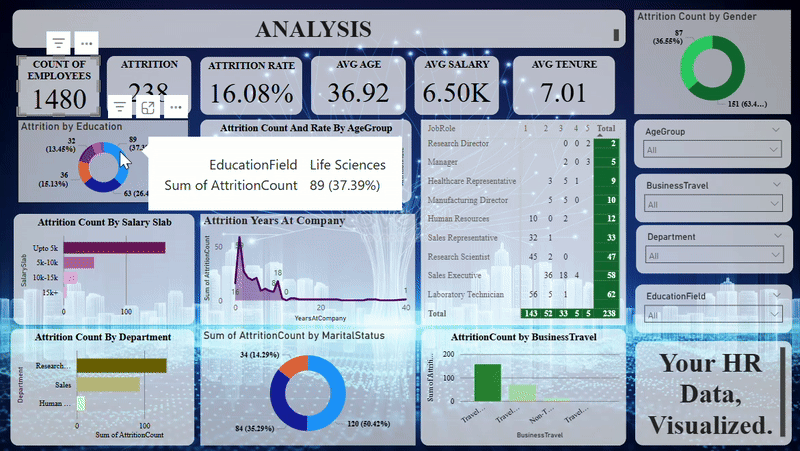

# Project1_HR_data
Project1 : HR Data Analytics Dashboard


1. **GIF animations** – Add a short animated GIF (e.g., screen recording of your Power BI dashboard in action).
2. **Badges** – Show project status, tools used, or technologies with professional-looking badges.
3. **Custom Styling** – Use emojis, markdown tables, and bold/italic fonts for polished formatting.
4. **Shields.io Badges** – Add badges like: 

---

### 🔁 Updated `README.md` Example with Badges and GIF Placeholder

You’ll need to create or upload your own GIF for animations.

````markdown
# 📊 HR Analytics Dashboard – Employee Attrition Analysis


---

## 🎥 Dashboard Preview (Animated)
  
*An animated walkthrough of the HR Analytics Dashboard*  
> _Tip: Upload a `.gif` file to your repo and link it here!_

---

## 📁 Repository Contents

| File | Description |
|------|-------------|
| `HR_Analytics.csv` | Cleaned dataset |
| `HR_data_analysis.pbix` | Power BI dashboard |
| `HR_data_analysis_Result.pdf` | Final report |
| `hrdata.jpg` | Static dashboard preview |
| `README.md` | Project documentation |

---

## 📈 Executive Summary

- **Total Employees:** 1,480  
- **Attrition Cases:** 238  
- **Attrition Rate:** 16.08%  
- **Avg Age:** 36.92 years  
- **Avg Salary:** $6.5K  
- **Avg Tenure:** 7.01 years  

---

## 🔍 Key Insights

✨ High attrition in **Sales Executive**, **Lab Technicians**  
🧑‍🤝‍🧑 Male attrition: ~63%  
💸 Employees earning under **$10K** most likely to leave  
🧭 Frequent **business travelers** more prone to churn  
📊 Sales department shows **highest attrition volume**

---

## 🛠 Tools Used

- 
- Microsoft Excel
- PDF for sharing insights

---

## 🚀 How to Use

1. Clone the repo:
   ```bash
   git clone https://github.com/GAURIPATIL-2004/Project1_HR-data.git
````

2. Open `.pbix` file in Power BI
3. Explore or export the report

---

## 🧩 Use Cases

* HR insights and workforce planning
* Strategic attrition reduction
* Business intelligence for leadership


---

